# 1. Лабораторная работа 5. Построение AST и проверка контекстно-зависимых условий

### **Автор:** Гусейнов Рза Анар Оглы ###
### **Группа:** АВТ-314 ###

## 2. Вариант задания: Лямбда-выражения языка Java ##
### operation = (x, y, z) -> x + (y * z); ###

### Примеры корректных входных строк: ###

` Function op = (int x, int y) -> x + y; ` (С явным указанием типов параметров и левой части) 

` mult = x -> x * 2; ` (Присваивание в существующую переменную, параметр без типа)

` () -> (10 + 5) / 2; ` (Без параметров, только арифметическое выражение)

## 3. Контекстно-зависимые условия (Семантические правила) ##
1) **Использование необъявленного идентификатора**	

() -> x + 5;

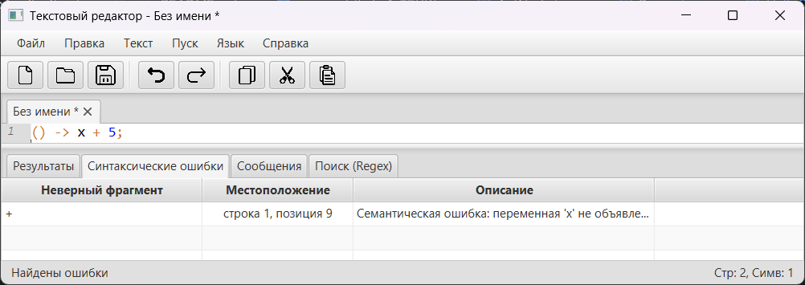
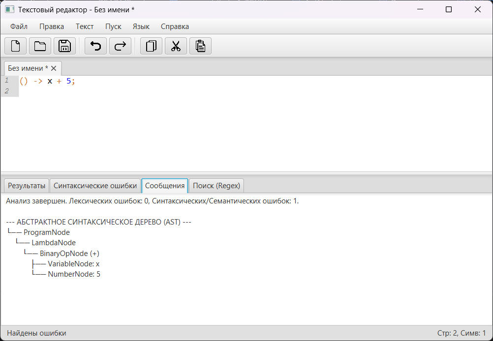

Семантическая ошибка: переменная 'x' не объявлена

2) **Нарушение уникальности имени (дубликат параметра)**

(x, x) -> x + 1;

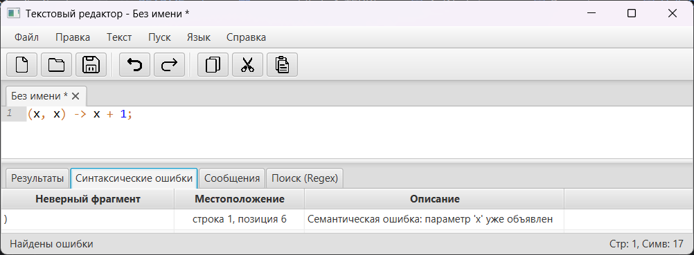
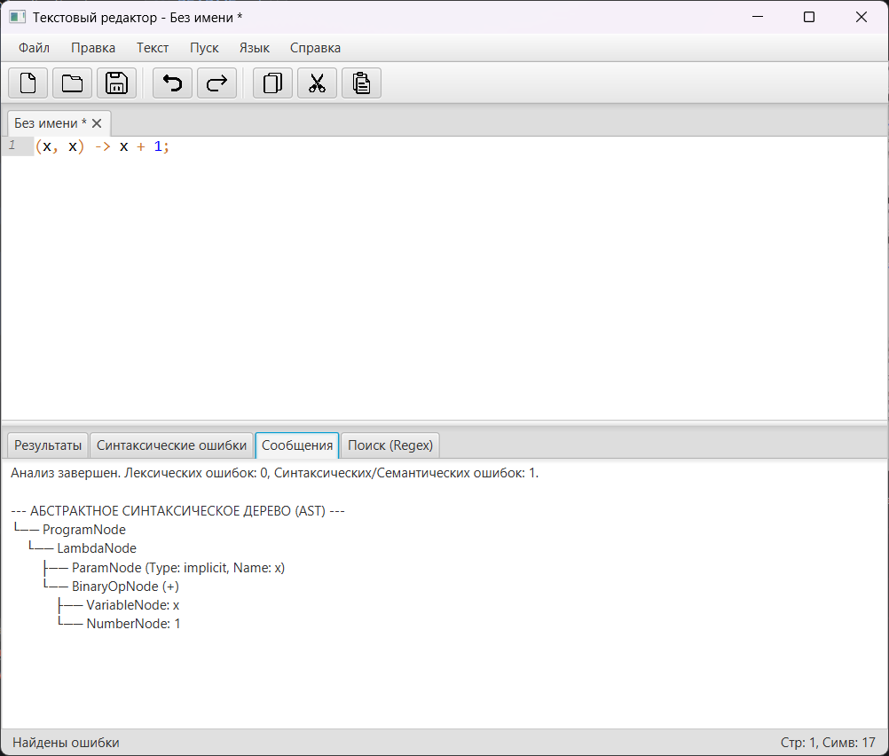

Семантическая ошибка: параметр 'x' уже объявлен

3) **Выход за допустимые значения**

x -> x + 9999999999999999999999;

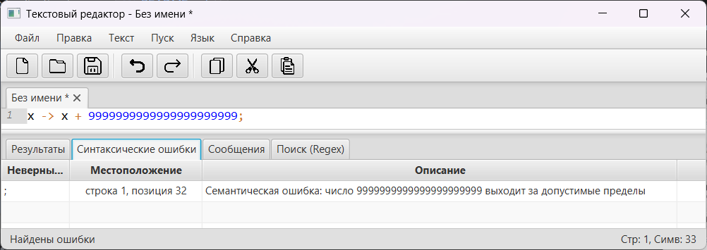
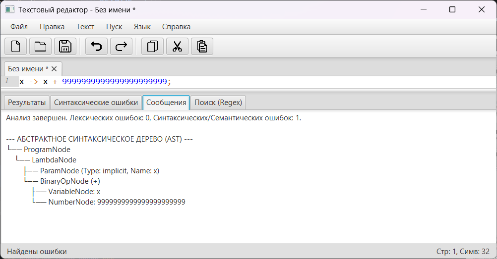

Семантическая ошибка: число 9999999999999999999999 выходит за допустимые значения

## 4. Структура AST (Абстрактного синтаксического дерева) ##

### Описание типов узлов ###
В основе структуры лежит базовый абстрактный класс AstNode, от которого наследуются конкретные узлы грамматики для разбора лямбда-выражений:

**ProgramNode** — корневой узел дерева. Содержит информацию о левой части присваивания (в данном случае тип по умолчанию var, имя operation) и ссылку на само лямбда-выражение.   

**LambdaNode** — узел лямбда-выражения. Содержит список параметров (List<ParamNode>) и тело выражения (ссылка на корень арифметического выражения).

**ParamNode** — узел формального параметра. Хранит тип параметра (явно указанный или implicit при отсутствии) и его имя (x, y, z).

**BinaryOpNode** — узел бинарной арифметической операции (в данном примере + и *). Содержит знак операции и ссылки на левое и правое поддеревья (операнды). Обеспечивает правильный приоритет операций благодаря иерархии (умножение находится ниже сложения).

**VariableNode** — листовой узел. Представляет использование конкретной переменной внутри тела лямбда-выражения.

### Рисунок CST / AST для верной строки в любом графическом редакторе ###

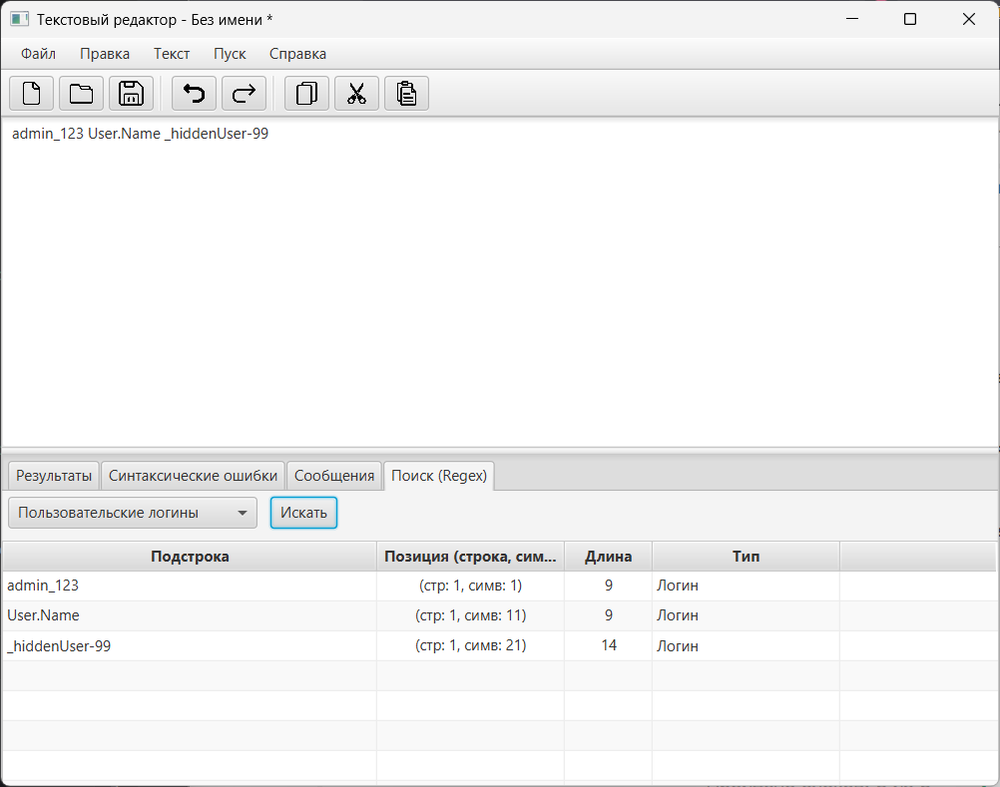

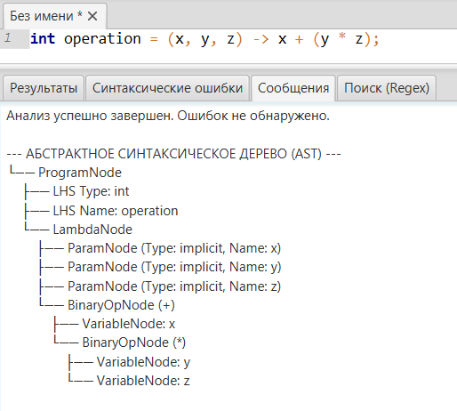

### Тестовые примеры ###

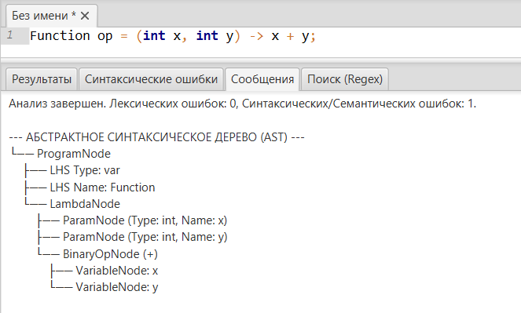

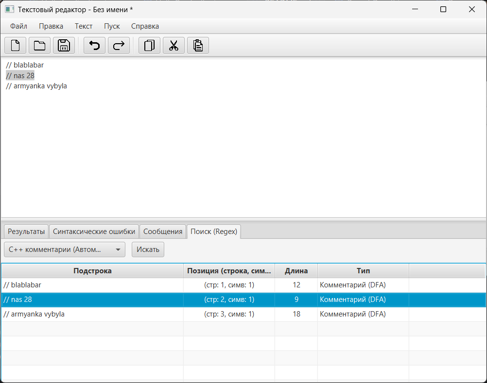

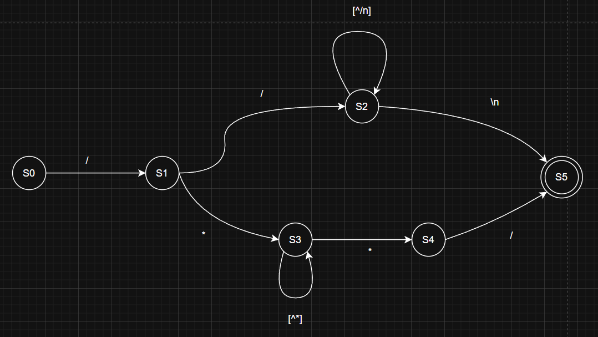

## 6. Инструкция по запуску ##
Проект представляет собой десктопное JavaFX-приложение, 
сборка и управление зависимостями которого осуществляются с помощью Maven.

Требования к окружению:
JDK (Java Development Kit): версия 17 или выше.

Apache Maven: для подтягивания зависимостей (JavaFX, RichTextFX) и сборки проекта.

Способ 1: Запуск через среду разработки (IntelliJ IDEA / Eclipse)
Это самый простой способ для проверки исходного кода.

Откройте директорию проекта в вашей IDE.

Дождитесь, пока Maven автоматически скачает и проиндексирует все необходимые библиотеки.

Откройте файл главного класса приложения: src/main/java/org/example/Lab2/HelloApplication.java.

Нажмите правой кнопкой мыши по коду внутри файла (или по зеленому треугольнику слева от объявления класса) и выберите Run 'HelloApplication.main()'.

Способ 2: Запуск через командную строку (Терминал)
Если вы предпочитаете работать через консоль:

Откройте терминал (или командную строку) и перейдите в корневую папку проекта (туда, где находится файл pom.xml).

Выполните команду для очистки старых сборок и компиляции новых файлов:

Bash
mvn clean compile

Запустите приложение с помощью встроенного плагина JavaFX:

Bash
mvn javafx:run

Способ 3: Сборка автономной версии (Portable / .exe)
Проект настроен на сборку портативной версии программы, которая включает в себя урезанную виртуальную машину Java (JRE). Это позволяет запускать редактор на любых компьютерах Windows, даже если там вообще не установлена Java.

В корневой папке проекта выполните команду:

Bash
mvn clean package jpackage:jpackage
После успешной сборки готовая папка с приложением и исполняемым .exe файлом появится по пути: target/dist/CourseWorkTFLK. Эту папку можно заархивировать и переносить на другие ПК.
